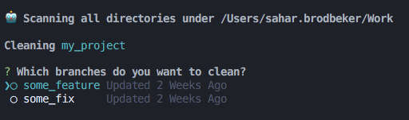

# branch-scanner [](https://www.npmjs.com/package/branch-scanner)

A tiny CLI program that lists all non-standard git branches of the current directory's subdirectories.


## Table of Contents

- [Installation and Usage](#installation-and-usage)
    * [Options](#options)
    * [Commands](#commands)
        * [`clean`](#clean)

## Installation and Usage

Intsall the program globally:
```sh
npm i -g branch-scanner
```

Then use it from your terminal like so:
```sh
branch-scanner
```

### Options

-r, --recursive

| Option | Alias | What it does | Positional arguments |
|----------|----------|----------|--------------------|
| `-v` | `--version` | Output the program's version number. | - |
| `-d` | `--directory` | Specify a directory to scan (default: "the current directory"). | An absolute or relative path to the directory you widh to scan. Defaults to the current directory. |
| `-r` | `--recursive` | Whether to keep running recursively or not (default: false). |- |
| `-h` | `--help` | Output the program's usage information. | - |

### Commands

#### `clean`

Launches the program in "clean" mode, scanning each directory individually and presenting a UI to select branches you wish to delete.


